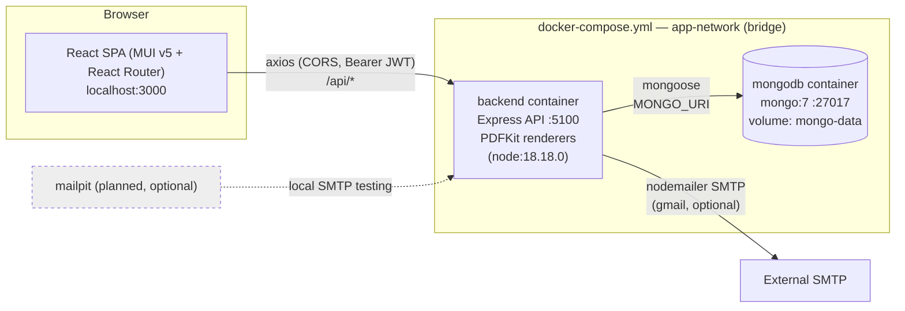
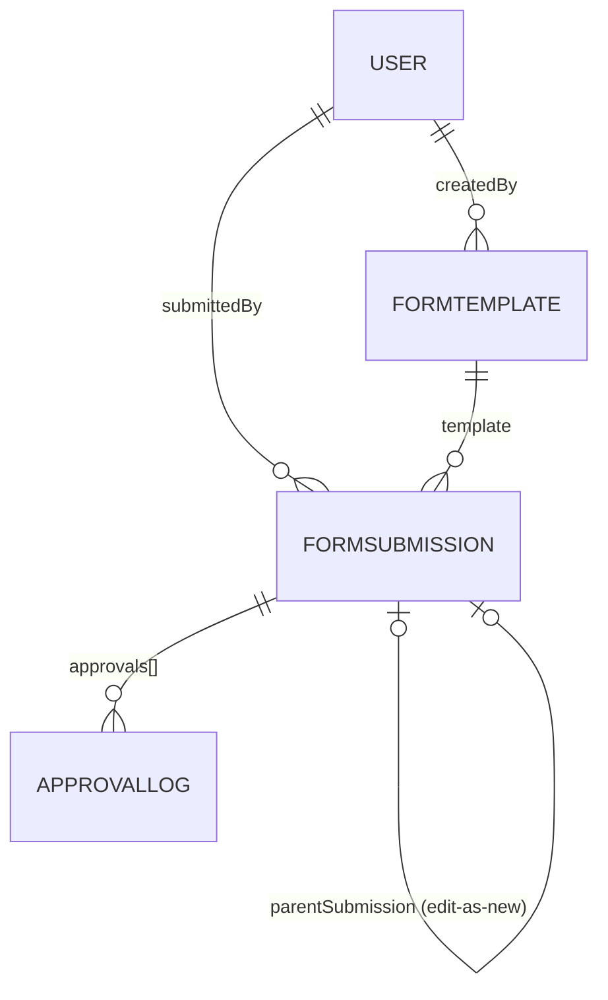

# System Architecture — IIT Patna Institute Form Portal

This document describes the architecture of the form portal that replaces Word-based institute forms with web forms, PDF output, submission history, and role-based approval routing. It reflects the **implemented** state of the repository (verified against code), and separately notes planned-but-unimplemented architecture from [`todo.md`](../todo.md).

## 1. High-Level System Diagram



- **Implemented containers** (`docker-compose.yml`): `mongodb` and `backend` only.
- **Planned but not yet in compose** (see [`todo.md`](todo.md) §3): a `frontend` container and an optional `mailpit` container.

## 2. Frontend Architecture

Location: `frontend/` — Create-React-App (react-scripts 5.0.1), React 18, MUI v5 (`@mui/material` 5.15.7), React Router v6.

### 2.1 Routing (`frontend/src/App.js`)

All private routes are wrapped in `PrivateRoute` (JWT check) + `Layout`; public auth pages use `AuthLayout`.

| Route | Page | Purpose |
|---|---|---|
| `/` | `pages/Login.js` | Login (JWT) |
| `/register` | `pages/Register.js` | Self-registration (@iitp.ac.in only) |
| `/forgot-password`, `/reset/:token` | `pages/ForgotPassword.js`, `pages/ResetPassword.js` | Password recovery |
| `/dashboard` | `pages/Dashboard.js` | Landing page, profile PDF download |
| `/forms` | `pages/Forms.js` | Form catalog, grouped by section |
| `/forms/<slug>` | `src/forms/<dept>/<FormName>.js` | ~20 hardcoded form components |
| `/forms/:templateRef` and `/forms/:templateId/fill` | `pages/FormFill.js` | Dynamic schema-driven form renderer |
| `/submissions` | `pages/Submissions.js` | History + PDF download + "edit as new" |
| `/approvals` | `pages/Approvals.js` | Approver inbox (approve/reject) |
| `/admin/bulk-import` | `pages/BulkImport.js` | CSV user import (SSE progress) |
| `/change-password` | `pages/ChangePassword.js` | Password change |

### 2.2 Form Component Pattern

One React component per form, mirroring one backend renderer per form:

- `frontend/src/forms/<dept>/<FormName>.js` — e.g. `security/SecurityRequisitionForVehicleSticker.js`.
- Department dirs: `genadmin/`, `security/`, `cc/`, `estb/`, `fin/`, `snp/`.
- Each component:
  1. Fetches its schema with `GET /api/forms/<template-slug>/template` (hardcoded `TEMPLATE_SLUG`).
  2. Renders an MUI form styled like the paper form (inline labels, underlined value fields).
  3. Submits via `prepareSubmissionPayload` → `POST /api/submissions` (`frontend/src/utils/formValidation.js`).
  4. Optionally triggers `GET /api/submissions/:id/pdf` (`responseType: "blob"`) and downloads it.
- `pages/FormFill.js` is the generic alternative: it renders any `FormTemplate.fields` schema (text, number, date, textarea, select, radio, table) and is used for catalog forms that have no dedicated component.

### 2.3 API Client (`frontend/src/services/api.js`)

- axios instance with `baseURL = process.env.REACT_APP_API_URL || "http://localhost:5100/api"`.
- Request interceptor: attaches `Authorization: Bearer <token>` from `localStorage`, and sanitizes JSON payloads (`sanitizeRequestData`) unless the payload is `FormData` (photo uploads).

### 2.4 Theme (`frontend/src/theme/theme.js`)

- MUI `createTheme`: primary `#0d47a1` (deep blue), secondary `#00695c` (teal), background `#f5f7fa`, "IBM Plex Sans" font stack, radius 8, `TextField` defaults to outlined/full-width.

## 3. Backend Architecture

Location: `backend/` — Node.js, Express 4.18.2, Mongoose 7.8.4 (CommonJS, `src/server.js` entry).

### 3.1 App Assembly (`backend/src/server.js`)

```
express.json({ limit: "1mb" }) → cors() → /api/auth → /api/forms → /api/submissions → /api/admin
```

Mongo connection happens inline: `mongoose.connect(process.env.MONGO_URI)` then `app.listen(process.env.PORT)`. (`backend/src/config/db.js` exports a `connectDB` helper that is **not** currently used by `server.js`.)

### 3.2 Middleware Chain

| Middleware | File | Behavior |
|---|---|---|
| `protect` | `backend/src/middleware/authMiddleware.js` | Requires `Authorization: Bearer` JWT; `jwt.verify(token, JWT_SECRET)` → `req.user = { id, role }` |
| `adminOnly` | `backend/src/middleware/adminMiddleware.js` | `403` unless `req.user.role === "Admin"` |
| multer (route-local) | `backend/src/routes/submissionRoutes.js`, `adminRoutes.js` | In-memory uploads; images ≤5 MB for submissions, `.csv` only for admin |
| `sseAuth` (route-local) | `backend/src/routes/adminRoutes.js` | JWT from query param (EventSource cannot send headers); requires Admin role |

### 3.3 Controllers

| Controller | Handles |
|---|---|
| `backend/src/controllers/authController.js` | `register` (only `@iitp.ac.in`; bcrypt cost 10), `login` (JWT, 7-day expiry), `getMe`, `generateProfilePdf` (PDFKit profile PDF with `iitp.jpg` logo), `forgotPassword` (SHA-256 reset token + 15 min expiry + nodemailer Gmail SMTP), `resetPassword`, `changePassword` |
| `backend/src/controllers/formController.js` | `createTemplate` (sanitized), `getAllTemplates` (creates/seeds all hardcoded template definitions on first call), `getMyTemplates`, plus one `get<Form>Template` per hardcoded form (create-if-missing in DB), and `getHardcodedCatalogTemplate` (looks up `backend/src/catalog/hardcodedTemplateCatalog.js`) |
| `backend/src/controllers/submissionController.js` | `submitForm`, `getMySubmissions`, `getSubmissionById`, `getPendingApprovals`, `actOnSubmission` (approve/reject), `generateSubmissionPDF` (renderer dispatch) |
| `backend/src/controllers/adminController.js` | `bulkImport` (csv-parse, async job with `jobId` in an in-memory `Map`), `bulkImportStream` (Server-Sent Events progress), `changeRole` |

### 3.4 Route Map

| Mount | Route | Auth | Notes |
|---|---|---|---|
| `/api/auth` | `POST /register`, `POST /login` | public | |
| | `GET /me`, `GET /generate-pdf`, `POST /change-password` | `protect` | |
| | `POST /forgot-password`, `POST /reset-password/:token` | public | |
| `/api/forms` | `POST /templates`, `GET /templates`, `GET /templates/me` | `protect` | |
| | `GET /<slug>/template` (~24 hardcoded) | `protect` | e.g. `security_requisition_for_vehicle_sticker/template` |
| | `GET /:templateCode/template` | `protect` | catalog fallback (`getHardcodedCatalogTemplate`) |
| `/api/submissions` | `POST /` (multer photo `responses[photo]`) | `protect` | body: `{ templateId, responses, parentSubmissionId? }` |
| | `GET /me`, `GET /pending/list`, `GET /:id` | `protect` | pending = current approver role |
| | `POST /:id/act` | `protect` | `{ action: approved\|rejected, comment? }` |
| | `GET /:id/pdf` | `protect` | streams PDF |
| `/api/admin` | `POST /bulk-import` (CSV) | `protect` + `adminOnly` | returns `{ jobId, total }` (202) |
| | `GET /bulk-import/:jobId/stream` | `sseAuth` | SSE progress |
| | `PATCH /change-role` | `protect` + `adminOnly` | |

## 4. Data Layer (MongoDB)

Three collections; no cross-collection denormalization beyond references.



| Model | File | Key fields |
|---|---|---|
| `User` | `backend/src/models/User.js` | `name`, `email` (unique, lowercase), `password` (bcrypt), `role` (`Faculty`/`HOD`/`Dean`/`Director`/`Admin`), `resetToken`, `resetTokenExpire` |
| `FormTemplate` | `backend/src/models/FormTemplate.js` | `code` (indexed), `title`, `description`, `section`, `fields[]` (label, name, type ∈ text/number/date/textarea/select/radio/file/email/table; options; section; table `columns[]`), `approvalStages[]` (ordered role list, e.g. `["HOD","Dean"]`), `createdBy` → User, `isActive` |
| `FormSubmission` | `backend/src/models/FormSubmission.js` | `template` → FormTemplate, `submittedBy` → User, `responses` (Map of Mixed), `photo` (Buffer + contentType), `status` (draft/submitted/approved/rejected), `version`, `parentSubmission` → FormSubmission (for "edit as new"), `approvalStages[]`, `currentStageIndex`, `approvals[]` (role, user, action ∈ approved/rejected, comment, actedAt) |

## 5. Form Rendering Pipeline

1. **Definition sources.** Every form's schema comes from code, in two flavors:
   - Inline constants in `backend/src/controllers/formController.js` (security, cc, estb, fin, genadmin, snp forms — e.g. `SECURITY_REQUISITION_FOR_VEHICLE_STICKER_TEMPLATE`).
   - Builder functions in `backend/src/catalog/hardcodedTemplateCatalog.js` (`buildConferenceAssistanceTemplate`, `buildNetworkExtensionTemplate`, `buildLtcApplicationTemplate`, `buildProcurementTemplate`, etc.) that populate `MISSING_HARDCODED_TEMPLATES` — served via `getHardcodedTemplateDefinition(code)`.
2. **Materialization.** The DB is a cache: on first fetch, `get<Form>Template`/`getAllTemplates`/`getHardcodedCatalogTemplate` create the `FormTemplate` document; `ensureTemplateFromDefinition` re-syncs title/fields/approvalStages when the code definition changes.
3. **Frontend component mapping.** Each frontend form component (`frontend/src/forms/<dept>/<FormName>.js`) fetches its template by slug and posts responses; dynamic forms use `FormFill.js`.
4. **PDF renderer mapping.** `generateSubmissionPDF` (`backend/src/controllers/submissionController.js`) compares `submission.template.code` against ~24 code constants and dispatches to the matching renderer in `backend/src/forms/<dept>/<Name>.js`; any unknown code falls back to `backend/src/forms/generic/renderStructuredTemplatePdf.js` (schema-driven: section headings, `label: value` rows, tables from `columns`).
5. **Where PDFs go.** PDFs are **not persisted to disk**. Each renderer draws into a `PDFKit` document piped straight to the HTTP response (`doc.pipe(res)`, `Content-Type: application/pdf`, `attachment; filename=form-<submissionId>.pdf`). Approval history is appended after the form body when `submission.approvals` is non-empty.

```
frontend form component ──GET /api/forms/<slug>/template──► schema
      │ POST /api/submissions (responses + optional photo)
      ▼
FormSubmission saved (status "submitted")
      │ GET /api/submissions/:id/pdf
      ▼
generateSubmissionPDF ──code dispatch──► src/forms/security/*.js (or cc/estb/fin/genadmin/snp)
      │                            └── no match ──► generic/renderStructuredTemplatePdf.js
      ▼
PDFKit doc ──pipe──► HTTP response (download in browser)
```

## 6. PDF Generation Strategy

- **Library:** `pdfkit` 0.14.0 (`pdf-lib` 1.17.1 is present in `backend/package.json` but unused). WeasyPrint is the **planned** backup (todo §2, §5F) — not implemented.
- **Shared helpers:**
  - `backend/src/utils/pdfUtils.js` — `getResponseValue` (reads a key from a Mongoose Map or plain object), `formatDate` (en-GB locale).
  - `backend/src/utils/pdfStyles.js` — font-size constants (TITLE 16, SECTION_HEADER 13, LABEL 11, BODY 11, SMALL 10) and helpers: `applyMainTitle`, `applySectionHeader`, `applyLabeledField` (label + underline), `applyFieldRow`, `applyBodyText`, `applyDeclarationHeader`, `applySignatureBlock`, `getFontSize`.
- **Renderer pattern** (e.g. `backend/src/forms/security/SecurityRequisitionForVehicleSticker.js`): pull values from `submission.responses` via `getResponseValue`, then draw a bordered table mimicking the paper form with `doc.rect`/`moveTo`/`lineTo`/`text` at absolute coordinates; margins vary per form (45–70 pt, A4).
- **Assets (`backend/src/assets/`):**
  - `NotoSansDevanagari.ttf` — registered as `HindiFont` by `backend/src/forms/estb/renderEstbDepartureRejoiningReportPdf.js` (with `fs.existsSync` guard) to print "भारतीय प्रौद्योगिकी संस्थान पटना".
  - `iitp-logo.png` — present but **not yet referenced by any renderer**; the profile PDF uses `iitp.jpg` at the repository root instead (`backend/src/controllers/authController.js:153`).
- Fonts are otherwise standard Helvetica family.

## 7. Request / Data Flow Examples

### 7.1 Login flow

```
POST /api/auth/login { email, password }
  → authController.login: normalize email → check IITP_EMAIL_REGEX → User.findOne
  → bcrypt.compare → jwt.sign({ id, role }, JWT_SECRET, 7d)
  → { token }  →  stored in localStorage
GET /api/auth/me (Authorization: Bearer <token>)
  → authMiddleware.protect verifies JWT → User.findById(req.user.id) (password excluded)
```

Forgot password: `POST /api/auth/forgot-password` → SHA-256 token stored with 15-min expiry → nodemailer sends `FRONTEND_URL/reset/<token>` (if `EMAIL_USER`/`EMAIL_PASS` unset, returns the URL in the JSON response instead). `POST /api/auth/reset-password/:token` hashes the token and re-validates before updating the password.

### 7.2 Form submission flow (incl. PDF)

```
Frontend form component → POST /api/submissions
  (FormData: templateId, responses[...], responses[photo]?, parentSubmissionId?)
  → multer memory upload (image only) → extractSubmissionPayload
  → template resolved by ObjectId or code → sanitizeAndValidateResponses
     (type checks, required, email/phone/Aadhaar/roll-no regex, select/radio whitelist)
  → parentSubmissionId set ⇒ version = parent.version + 1 (edit-as-new, old untouched)
  → FormSubmission.create({ status: "submitted", approvalStages: template.approvalStages, ... })
  → 201 submission JSON
GET /api/submissions/:id/pdf → dispatch renderer → PDF streamed to browser
```

### 7.3 Approval flow

```
GET /api/submissions/pending/list
  → status "submitted" AND role ∈ approvalStages AND currentStageIndex points at role
POST /api/submissions/:id/act { action, comment }
  → only current-stage role can act → approval log entry
  → "rejected" ⇒ status=rejected; else advance currentStageIndex or status=approved
GET /api/submissions/me → owner history (sorted newest first)
```

### 7.4 Admin bulk user import

```
POST /api/admin/bulk-import (CSV: name, email, role, password?)
  → csv-parse → jobId (crypto.randomUUID) → 202 { jobId, total }
  → async processRows: per-row validation (@iitp.ac.in, roles, bcrypt) → in-memory job map
GET /api/admin/bulk-import/:jobId/stream (SSE, token in query)
  → streams {type:"row"} events, then {type:"complete", created, failed}
```

## 8. Docker / Deployment Topology

`docker-compose.yml` (bridge network `app-network`):

| Service | Image / build | Port | Env | Persistence |
|---|---|---|---|---|
| `mongodb` | `mongo:7` | `27017:27017` | — | `mongo-data:/data/db` |
| `backend` | `./backend` (Dockerfile) | `5100:5100` | `env_file: ./backend/.env` | — |

- `backend/Dockerfile`: `node:18.18.0`, `npm install`, copies `.env`, `CMD ["npm","start"]`.
- `backend/.env.example` defines `PORT`, `MONGO_URI`, `JWT_SECRET`, `EMAIL_USER`, `EMAIL_PASS`.
- Backend expects `MONGO_URI` pointing at the `mongodb` service (e.g. `mongodb://mongodb:27017/...`).
- No health checks yet; no frontend image yet (todo §10).
- Frontend dev server runs on `localhost:3000` (CRA) and calls the API at `http://localhost:5100/api` by default.

## 9. Planned-but-Not-Implemented Architecture

From [`todo.md`](todo.md) — target state, not yet in code:

- **Approval workflow engine (todo §5E, §7, §11 Phase 4):** dynamic per-form actor chains (faculty→HOD→dean→director variants), send-back/forward actions, full audit log, approver inbox. *Partially implemented*: staged approval already exists in `FormSubmission.approvalStages`/`currentStageIndex` with approve/reject only (`actOnSubmission`).
- **DB-driven form schema (todo §5C):** admin-defined form builder with textbox/radio/date/dropdown, so new forms need no code. *Partially implemented*: schema is code-first (controllers + catalog) with the DB acting as a materialized cache; a generic `FormFill.js` renderer and `FormTemplate.fields` already support rendering any schema.
- **FormCategory model** for 100+ form catalog (todo §6) — currently section grouping is derived from `FormTemplate.section`/code strings in `frontend/src/pages/Forms.js`.
- **Frontend + mailpit containers** in `docker-compose.yml` (todo §3).
- **WeasyPrint backup** for PDF generation (todo §2, §5F).
- **Hard version pinning:** backend deps are pinned exactly (except `nodemon`), but `frontend/package.json` still uses `^` ranges; base images not yet version-pinned to the letter (todo §4, §10).
- **Security hardening (todo §9):** rate limiting on login/forgot-password, per-role/per-workflow form access checks, admin/approval audit logging, JWT on all protected routes (partially done — most routes use `protect`).
- **Password reset email** uses Gmail SMTP directly; Mailpit/local SMTP not wired (todo §2).
